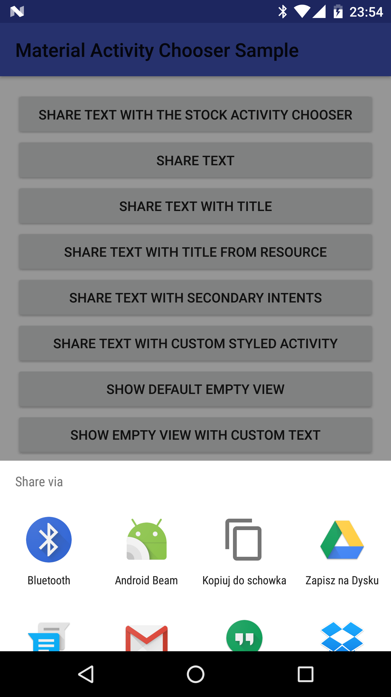
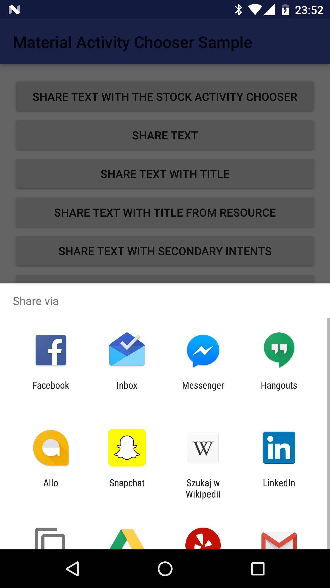
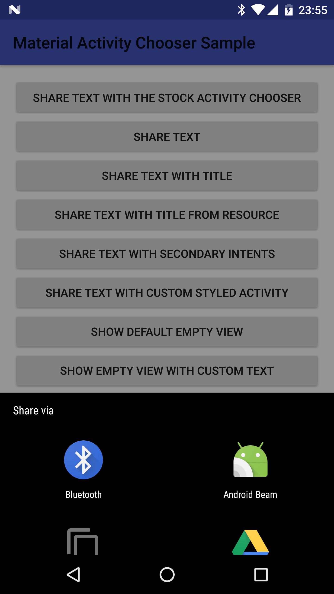
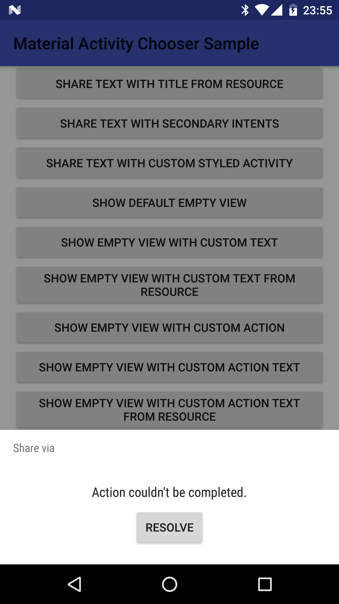
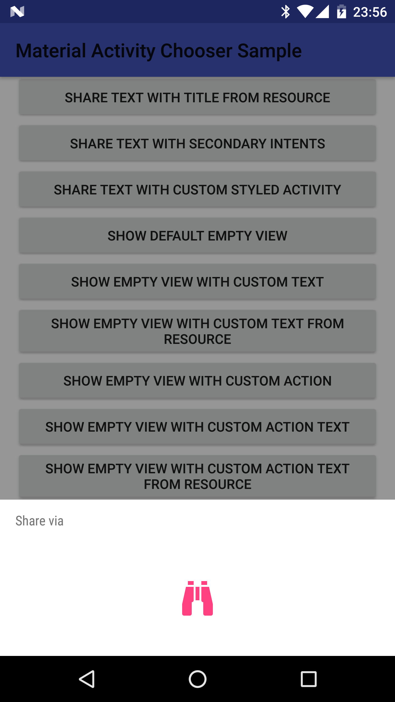

# Android Material Activity Chooser

This library allows to use Material activity choosers from Jelly Bean+ to e.g. share a text or a link using a nice Material dialog.
Material activity choosers are displayed as bottom sheet dialogs.
Bottom sheets are described here: https://material.google.com/components/bottom-sheets.html 
The actual implementation of activity choosers varies depending on the OS version.
This library tries to mimic the activity chooser version you can see on Android Nougat e.g. on Nexus 6P.

## Download (from JCenter)
```groovy
compile 'com.github.zawadz88:material-activity-chooser:0.1.1'
```

## Supported features
  - showing the activity chooser as a bottom sheet dialog on all OS versions starting from Jelly Bean (API 16)+
  - setting custom bottom sheet titles
  - setting different intents per activity, e.g. to have different messages for different applications when sharing
  - use custom styles for the bottom sheet
  - setting a custom message/button text for the empty view when no activities are found
  - setting a custom view when no activities are found
  - adding a button which triggers a PendingIntent when clicked when no activities are found
  - adding custom actions when an activity was clicked
  - going to the chosen activity settings on long-click
  
## Screenshots
  - Showcase<br/>

  - Sharing with MaterialActivityChooser<br/>

  - Sharing with the system IntentChooser on Nougat for comparison<br/>

  - Sharing with MaterialActivityChooser with custom style<br/>

  - Sharing with MaterialActivityChooser when no activities found<br/>

  - Sharing with MaterialActivityChooser when no activities found with a custom view<br/>

  
## Getting started

### Add Activity Chooser activity to AndroidManifest.xml

In AndroidManifest.xml add:

```xml
    <activity
        android:name="com.github.zawadz88.activitychooser.MaterialActivityChooserActivity"
        android:theme="@style/MACTheme" />
```

### Showing an activity chooser
To show an activity chooser you need to pass it the intent as follows:

```java
    new MaterialActivityChooserBuilder(context)
        .withIntent(someIntent)
        .show();
```

## Choosing a custom dialog title
You can set a custom bottom sheet dialog title with either a String or a String resource ID, e.g.

```java
    new MaterialActivityChooserBuilder(context)
        .withIntent(someIntent)
        .withTitle("Some custom title")
        .show();
```

or

```java
    new MaterialActivityChooserBuilder(context)
        .withIntent(someIntent)
        .withTitle(R.string.custom_share_title)
        .show();
```

## Using alternative intents for selected apps
It is possible to use alternative intents for selected applications instead of the main intent 
e.g. assuming you wanted to share a message, but you wanted to have a slightly different message for common Mail apps.
This can be done by e.g.

```java
    new MaterialActivityChooserBuilder(context)
        .withIntent(shareIntent)
        .withSecondaryIntent(alternativeShareIntent,
            "com.google.android.gm" /* GMail */,
            "com.google.android.apps.inbox" /* Inbox */,
            "com.microsoft.office.outlook" /* Microsoft Outlook */,
            "com.google.android.email" /* Default mail app */)
        .show();
```

## Choosing a custom empty view message
You can set a custom bottom sheet dialog empty view title with either a String or a String resource ID, e.g.

```java
    new MaterialActivityChooserBuilder(context)
        .withIntent(someIntent)
        .withEmptyViewTitle("Some custom empty view title")
        .show();
```

or

```java
    new MaterialActivityChooserBuilder(context)
        .withIntent(someIntent)
        .withEmptyViewTitle(R.string.custom_empty_view_title)
        .show();
```

## Showing a button on empty view
You can show a button on the empty view which will trigger a PendingIntent once clicked. To do so you need to provide the PendingIntent with/without a button title, e.g.

```java
    new MaterialActivityChooserBuilder(context)
        .withIntent(someIntent)
        .withEmptyViewAction(pendingIntent)
        .show();
```

or

```java
    new MaterialActivityChooserBuilder(context)
        .withIntent(someIntent)
        .withEmptyViewAction("Custom button title", pendingIntent)
        .show();
```

or

```java
    new MaterialActivityChooserBuilder(context)
        .withIntent(someIntent)
        .withEmptyViewAction(R.string.custom_button_title, pendingIntent)
        .show();
```

## Setting a custom empty view
You can inflate an entirely custom empty view as well, e.g.

```java
    new MaterialActivityChooserBuilder(context)
        .withIntent(someIntent)
        .withEmptyViewCustomView(R.layout.layout_custom_empty_view)
        .show();

```

## Styling the dialog to your own needs
You can override the default styling of the Activity Chooser to your own needs.
The easiest way is to override the 

## Tracking when an activity was clicked
You might want to track/log when an activity has been selected to handle your intent. To do so you can extend the default MaterialActivityChooserActivity.

```java
public class TrackingActivityChooserActivity extends MaterialActivityChooserActivity {

    ...

    @Override
    public void onActivityClicked(ResolveInfo activity) {
        Toast.makeText(this, "Application clicked: " + activity.activityInfo.packageName, Toast.LENGTH_SHORT).show();
        super.onActivityClicked(activity);
    }
}
```

which needs to be declared in the AndroidManifest.xml

```xml
    <activity
        android:name=".TrackingActivityChooserActivity"
        android:theme="@style/MACTheme" />
```

and also declared when building the activity chooser:

```java
    new MaterialActivityChooserBuilder(this)
        .withIntent(getDefaultShareIntent())
        .withActivity(TrackingActivityChooserActivity.class)
        .show();
```

## Notes
This library comes with a number of dependencies.<br/>
It relies on the BottomSheetBehavior from Android Support Design Library and it uses a RecyclerView for displaying a list of items.

## License
Copyright 2016 Piotr Zawadzki
    
Licensed under the Apache License, Version 2.0 (the "License");
you may not use this file except in compliance with the License.
You may obtain a copy of the License at
    
&nbsp;&nbsp;&nbsp;&nbsp;[http://www.apache.org/licenses/LICENSE-2.0](http://www.apache.org/licenses/LICENSE-2.0)
    
Unless required by applicable law or agreed to in writing, software
distributed under the License is distributed on an "AS IS" BASIS,
WITHOUT WARRANTIES OR CONDITIONS OF ANY KIND, either express or implied.
See the License for the specific language governing permissions and
limitations under the License.
